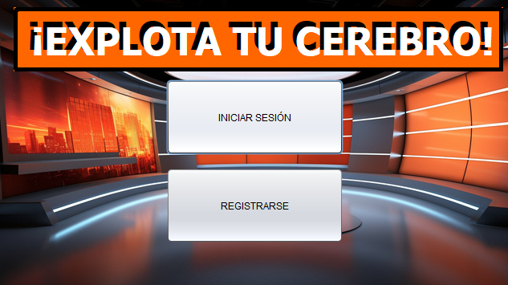

# ExplotaTuCerebro - A Quiz App with Java on NetBeans.

Build a Quiz App with Java to improve your BackEnd development.

> If you have questions, please do not hesitate to contact us.

Resources

-   [NetBeans IDE 21 Windows .exe](https://www.apache.org/dyn/closer.lua/netbeans/netbeans-installers/21/Apache-NetBeans-21-bin-windows-x64.exe)
-   [Java JDK 17 or above](https://www.oracle.com/es/java/technologies/downloads/#java17)
-   [XAMPP last version](https://www.apachefriends.org/es/download.html)
